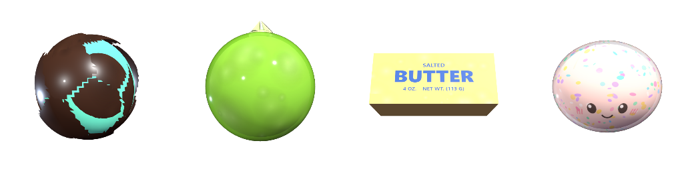

# 왁뿌볼 (Wakppu Ball)

말랑한 클레이 겉면에 왁스를 코팅해 굳힌 ASMR 촉감 장난감 **왁뿌말랑이**를 데스크탑에서 부수는 위젯입니다.
배경이 뚫린 작은 창에 왁뿌볼만 떠 있고, 꾹 누르면 누른 만큼 왁스가 갈라졌다가 손을 떼면 천천히 아뭅니다.



## 설치

### 방법 1 — exe (Python 없이)

[Releases](../../releases)에서 `WakppuBall.exe`를 받아 **원하는 폴더에 두고** 실행하세요.

**처음 실행하면 바탕화면에 바로가기가 자동으로 생깁니다.** 그다음부터는 바로가기로 켜면 됩니다.
바로가기를 지우면 다시 만들지 않으니, 필요하면 ⋯ 메뉴의 `바탕화면에 바로가기 만들기`를 누르세요.

> exe 를 다른 폴더로 옮기면 바로가기가 끊깁니다. 옮긴 뒤 ⋯ 메뉴에서 다시 만들면 됩니다.
> 그래서 처음에 받은 파일을 **옮기지 않을 폴더**(예: `문서\왁뿌볼\`)에 두는 편이 좋습니다.

설치 과정이 없고 레지스트리도 건드리지 않습니다. 지울 때는 exe 와 바탕화면 바로가기,
그리고 `%LOCALAPPDATA%\wakppu` 폴더만 삭제하면 완전히 지워집니다.

받은 뒤 `왁뿌볼.exe`로 이름을 바꿔도 그대로 동작합니다. 파일명이 영문인 이유는
GitHub이 릴리스 자산 파일명에서 한글을 지워 버리기 때문입니다. 속성창·작업관리자에는
`왁뿌볼`로 표시됩니다.

- Windows 10/11 · WebView2 런타임 필요 (Windows 11은 기본 탑재, Windows 10도 Edge가 있으면 대부분 설치되어 있음)
- 위젯에 필요한 모든 것(3D 라이브러리 · 음원 · 아이콘)이 exe 한 파일에 들어 있습니다
- 처음 실행할 때 Windows SmartScreen 경고가 뜰 수 있습니다. 서명하지 않은 개인 빌드라 그렇습니다.
  `추가 정보` → `실행`을 누르면 됩니다.
- 실행 기록은 exe 옆에 `wakppu.log`로 남습니다

### 방법 2 — 소스에서 실행

Windows 10/11 + Python 3.10 이상이 필요합니다.

```bash
pip install pywebview
python widget.py
```

콘솔 창 없이 띄우려면 `pythonw.exe widget.py`, 또는 `왁뿌볼.bat`을 실행하세요.

### 바탕화면 바로가기

```powershell
powershell -ExecutionPolicy Bypass -File ".\바로가기 만들기.ps1"
```

바탕화면에 `왁뿌볼.lnk`가 생깁니다. 아이콘(`wakppu.ico`)은 위젯을 직접 렌더해서 만든
16~256px 6단계짜리라 작업표시줄에서도 또렷합니다.

## 조작

| 동작 | 결과 |
|---|---|
| 공을 꾹 누르기 | 누르고 있는 동안 균열이 계속 번진다 (1초면 완전히 부서짐) |
| 손 떼기 | 균열이 2.2초에 걸쳐 아물고, 눌린 자국은 5초에 걸쳐 펴진다 |
| 같은 자리 반복해서 누르기 | 그 부근 조각이 점점 더 잘게 쪼개진다 |
| 공을 끌기 | 창이 움직인다 |
| 스페이스바 | 마우스 대신 누르기 |
| 우측 상단 ⋯ | 디자인 · 색상 · 크기 설정 |
| Esc | 종료 |

빈 배경은 완전히 투명하지만 클릭은 위젯이 받습니다.

## 디자인

- **초코** — 초콜릿 왁스가 갈라지며 그 틈으로 속 클레이 색이 드러납니다
- **청사과** — 반투명 젤리에 비닐 매듭이 달린 왁뿌말랑이
- **버터** — `SALTED BUTTER` 라벨이 붙은 버터 스틱
- **만두** — 홀로그램 반짝이가 든 글리터 만두

색상 7종을 고를 수 있습니다. 초코만 고른 색이 **속살**에, 나머지는 **껍질**에 적용됩니다.

## 만듦새

- **불규칙 파편** — 표면에 씨앗을 뿌려 보로노이로 껍질을 나눕니다. 격자로 자르면 균열이 규칙적으로 보입니다. 인접 조각이 변을 정확히 공유하므로 평소엔 이음새가 아예 보이지 않습니다.
- **제자리 파쇄** — 조각을 각자의 무게중심 기준으로 회전시키고, 꺾인 만큼 안쪽으로 밀어 실루엣 밖으로 벌어지지 않게 상쇄합니다.
- **아이클레이 속살** — 누른 지점을 중심으로 속 메시의 정점을 직접 밀어 넣습니다. 고무공처럼 튕기지 않고 눌린 자국이 남았다가 천천히 펴집니다.
- **투명 배경** — 색상 키(TransparencyKey) 방식은 창을 레이어드 윈도우로 만드는데, WebView2가 별도 자식 창에 그려지는 탓에 클릭이 전부 뒤로 통과해 위젯이 먹통이 됩니다. 그래서 DWM에 창을 넘겨 순수 검정을 투명으로 처리합니다 (`punch_dwm`).

## 구조

```
widget.py          pywebview 창 (투명 처리 · 창 이동/크기 · 종료)
index.html         위젯 전체 (3D · 상호작용 · 소리)
vendor/three.min.js
sfx/               누를 때 재생되는 파열음
wakppu.ico         16~256px 6단계 아이콘 (위젯을 직접 렌더해서 만듦)
wakppu.spec        PyInstaller 빌드 설정
version_info.txt   exe 속성창에 표시될 이름 (한글)
```

### exe 직접 빌드하기

```bash
pip install pyinstaller
pyinstaller wakppu.spec --noconfirm --clean
```

`dist/왁뿌볼.exe` 한 파일로 나옵니다. `index.html`·`three.min.js`·음원·아이콘이 모두 안에
들어가고, 실행하면 임시 폴더에 풀린 뒤 `file://`로 열립니다. 로그만은 사라지지 않도록
exe 옆에 씁니다.

문제가 생기면 `wakppu.log`에 페이지 진행 상황과 자바스크립트 오류가 남습니다.

## 라이선스

코드는 MIT입니다. `vendor/three.min.js`는 [three.js](https://github.com/mrdoob/three.js) r149 (MIT).

### 음원

`sfx/`의 파열음은 ASMR 크리에이터 [waisyasmr](https://www.youtube.com/@waisyasmr)의
왁스 크래킹 영상에서 가져온 것으로, **저작권은 원 제작자에게 있습니다.**

이 저장소는 개인용 비공개 저장소입니다. 공개로 전환하거나 재배포할 계획이라면 이 파일들을
먼저 빼고, 재배포가 허용된 음원(예: [Freesound](https://freesound.org)의 CC0,
[Pixabay Sound Effects](https://pixabay.com/sound-effects/))으로 교체하세요.
`wax cracking`, `crunch`, `ice crack` 등으로 검색하면 됩니다. 2~4초 길이가 적당합니다.

음원 파일이 없어도 위젯은 소리 없이 정상 동작합니다.
